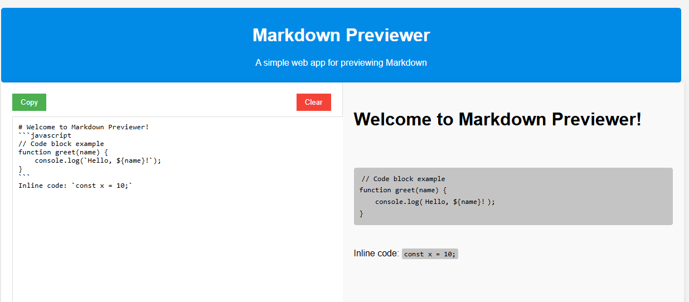

# Markdown Previewer

## Overview

Markdown Previewer is a simple web application that allows users to enter Markdown text and see a real-time HTML preview of the formatted content. The application supports various Markdown elements such as headings, emphasis, links, lists, and code blocks.

## Features

- **Real-time Preview**: Automatically updates the preview as you type.
- **Markdown Elements Supported**:
  - Headings
  - Bold and Italic text
  - Links
  - Unordered and Ordered Lists
  - Code Blocks
- **Utilities**:
  - Copy Markdown to clipboard
  - Clear editor content

## Usage

1. Open the `index.html` file in a web browser.
2. Enter your Markdown text in the input area on the left.
3. View the HTML-formatted preview on the right.

## Files

- `index.html`: The main HTML file containing the layout and structure of the app.
- `script.js`: JavaScript for parsing Markdown and updating the preview.
- `style.css`: Stylesheet for the application.
- `README.md`: This file.

## Development

To extend or modify the application, edit the JavaScript functions in `script.js` and adjust the HTML/CSS as needed.

## License

This project is open-source and available under the MIT License.

